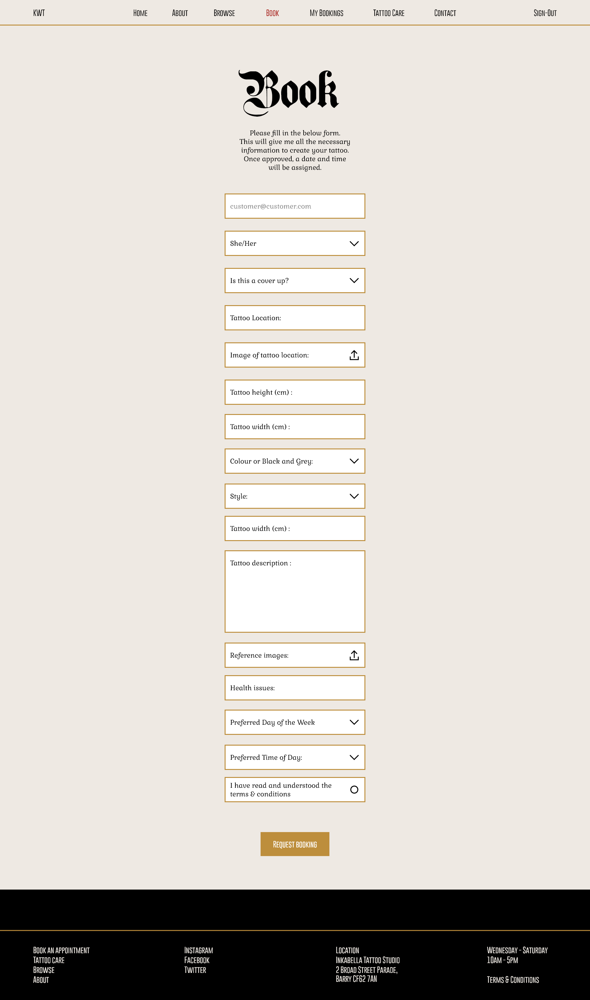
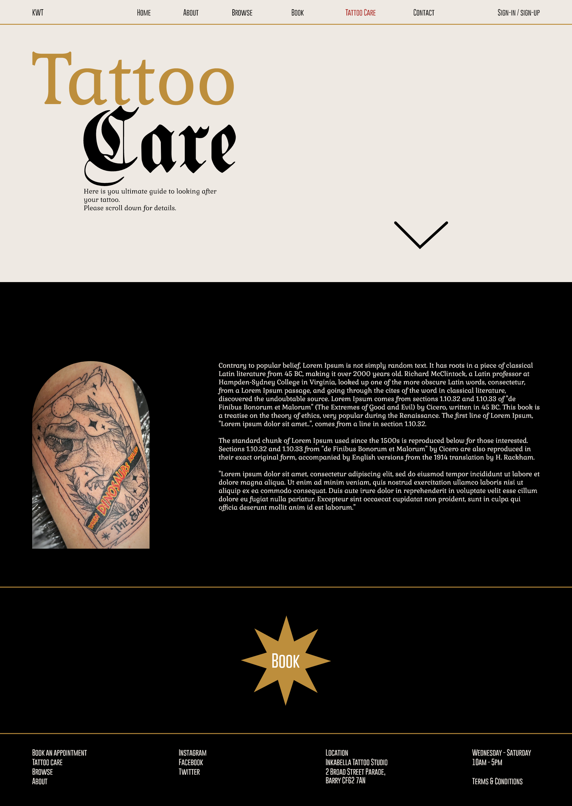
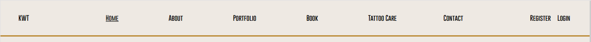

# [Kit Wagstaff Tattoo Website](https://jbh19-kwt-website-6d772e1d0754.herokuapp.com)
### Full-Stack capstone project.  Created during the Code Institute Full-Stack developer bootcamp.  
  
  

  
  
## Overview
A local tattoo artist "Kit Wagstaff" recently approached me and asked if i could design and build a website for them. I asked them what they wanted the website to be - was it to be a portfolio site or more of a shop?  
They replied with a story:  
Many tattoo artists and their customers use instagram as a platform to communicate. Instagram is used to contact artists, book appointments, send reference images and so on. This method presents many issues surrounding time. Time spent looking for previous images, time spent copying and pasting terms & conditions, time spent asking the same questions over and over again. This time should be used to design tattoos, learn techniques and improve the craft.  
The artist said that this site needs to include a booking service where clients can request a booking that contains all the necessary information for the artist to assign an appointment and get started with their design work.  
This booking system also needs to give the client the option of editing or deleting their appointment, in case something changes.  
The aim of this system is not completely remove the human-aspect of the tattoo booking process. There will be contact information available on the site, in case further questions need answering.  
The artist also requested that a portfolio page should be included which shows the client a variety of the artist's designs, with the most recent being displayed first.  
The remaining pages would be dedicated to; about the artist, terms & conditions, and tattoo care.  

We began the development process by identifying the artist's target audience:  
   
- 20 to 35 year old female
- Student or Professional
- Alternative style 
- Climate concious and LGBTQ+ supporter

Understanding the artist's target audience will give us the necessary information to create user stories which will ultimately dictate the site's design and features.  
  
## UX
### Overview  
I spoke to the artist and gathered as much information as i could about them as a person and as an artist. I then asked them if they had a design in mind for their website. They said that it would be great to base the design off of their gift voucher:
   

   
The next step was to create user stories with pragmatic success criteria.  
These user stories were used to create issues which then populated the project's kanban board. 
This information combined with the site's objective guided me on my search for similar websites.   
After an idea had formed, i drew up a wireframe using Adobe XD which was then showed to the artist.  
Once the wireframe was completed and approved, we were ready for the build. 

### Colour Scheme
The colour scheme was created using the gift voucher as a guide in order to ensure continuity.

- `#000` used for primary colour.
- `#EEE9E3` used for secondary colour.
- `#A51813` used for primary highlights.
- `#BD8E3C` used for secondary highlights.


  
This colour scheme was placed within the `:root` variables to easily update the global colour scheme by changing only one value, instead of everywhere in the CSS file.

```css
:root {
    /* Colours */
    --clr-red: #A51813;
    --clr-gold: #BD8E3C;
    --clr-black: #000;
    --clr-l-grey: #EEE9E3;
}
```
  
### Typography
The fonts were selected using the gift voucher as a guide. The exact fonts used for the gift voucher were not available to use on site, so alternatives were used instead.  
The fonts were imported from googlefonts and cdnfonts.
The navbar's hamburger icon was imported from FontAwesome.  

- [PlainGermanica](https://www.cdnfonts.com/germanica-family.font) was used as the primary title font.
- [Gabriela](https://fonts.google.com/specimen/Gabriela) was used as the secondary title and main text font.
- [GoboldThin](https://www.cdnfonts.com/gobold.font) was used and the tertiary font for menus, buttons, and titles.
  
These fonts and their main sizes were placed within the `:root` variables to easily update the global font family and font sizes by changing only one value, instead of everywhere in the CSS file.
  
```css
:root {
    /* Font family */
    --ff-primary: 'PlainGermanica', sans-serif;
    --ff-secondary: 'Gobold Thin', sans-serif;
    --ff-text: 'Gabriela', serif;

    /* Font sizes */
    --fs-title: clamp(5rem, 15vw, 16rem);
    --fs-title-2: clamp(5rem, 12vw, 16rem);
    --fs-subtitle: clamp(3rem, 10vw, 14rem);
    --fs-subtitle-2: clamp(2rem, 7vw, 5rem);
    --fs-text: 1.35rem;
}
``` 
  
## User Stories
### Site Users

- As a customer i want to easily book a tattoo appoinment so that i can avoid convoluted booking processes
- As a customer i want to have the ability to update an appointment so that i can request changes if they are needed
- As a customer i want to ensure that only i can access my appointments so that unknown users cannot edit my appointments or see personal info
- As a customer i want to get to know the artist so that i feel comfortable

### Site Owner

- As a site owner i want to get as much information as possible in the booking process so that the design process is straight forward
- As a site owner i want to easily access my upcoming appointments so that i can manage my business effectively
- As a site owner i want to give my clients clear instructions for tattoo after care so that they can avoid risk of infection
- As a site owner i want to have a clean and intuitive site so that my customer's journey is effortless and encourages repeat visits

### Developer 

- As a developer i want to ensure that the project's code is scalable and adheres to current standards so that future additions are fast to implement
  
## Wireframes
To follow best practice, wireframes were developed for mobile, tablet, and desktop sizes.  
I concentrated on designing the wireframes for all pages on desktop first.   
I then created one wireframe for tablet and one for mobile to provide a guide for placement and spacing. 
I've used [AdobeXD](https://helpx.adobe.com/xd/get-started.html) to design the site's wireframes.

### Mobile Wireframes

<details>
<summary> Click here to see the Mobile Wireframes </summary>

Home
  - 

</details>

### Tablet Wireframes

<details>
<summary> Click here to see the Tablet Wireframes </summary>

Home
  - 

</details>

### Desktop Wireframes

<details>
<summary> Click here to see the Desktop Wireframes </summary>

Home
  - 

About
  - 

Portfolio
  - 

My Bookings
  - 

Book
  - 

Update Booking
  - 

Register
  - 

Login
  - 

Terms & Conditions
  - 

Tattoo Care
  - 
  
</details>

## Features
### Existing Features

- **Navbar**

    - The navbar provides the user with an intuitive navigation method for the site. The desktop navbar is fixed to the top of each page to allow users to always be aware of their location on the site and to have easy access to other areas of the site. Depending on the user's logged in state, the navabr changes to allow users to view their bookings. The navbar in mobile and tablet view is initially hidden and only revealed if the user clicks on the burger icon.





- **Booking form**

    - The booking form filled in by the user to provide all the initial information which is needed to create a booking request for a tattoo. The form is clear and solitary on the page to allow for a concise booking experience.


- **Update booking form**

    - The update booking form is prepoulated by the user's previous booking information. This will allow the user to clearly identify which sections need to be edited.


- **My bookings**

    - The "my bookings" page allows the user to view, edit, and delete their bookings. This is their main port of call when managing their approved and pending bookings. 


- **Portfolio**

    - The portfolio allows the artist to display their favourite tattoo designs. It also allows the user to browse previous work so that they can decide if the artist is right for them. The portfolio page also offers the user the option to browse the gallery in a carousel view to avoid the scroll.


- **Book button**

    - The book button allows the user to jump to the booking form in one click, if they are registered. If the user is not currently registered, the button will direct them to the registration page.


- **Login and Register**

    - These two pages allow the user to either register or login in order access the booking and my bookings features.


### Future Features

- Artists own management page
    - Currently the artist manages their bookings and portfolio via the admin panel. The next iteration will include dedicated pages where the artist can access and manage their bookings along with an intuitive method to upload or delete images from the portfolio.
- Online merch shop
    - The site will have a merch site where clients can purchase clothing and prints featuring the artist's designs.
- Flash booking system
    - The site will have a separate booking page which is specifically for flash designs. Flash designs do not require any design information as they are predesigned. The user will need to specify a location, date, and time. The user will need to pay a 50% deposit upon booking the tattoo.

## Tools & Technologies Used

- [HTML](https://en.wikipedia.org/wiki/HTML) used for the main site content.
- [CSS](https://en.wikipedia.org/wiki/CSS) used for the main site design and layout.
- [CSS :root variables](https://www.w3schools.com/css/css3_variables.asp) used for reusable styles throughout the site.
- [CSS Flexbox](https://www.w3schools.com/css/css3_flexbox.asp) used for an enhanced responsive layout.
- [JavaScript](https://www.javascript.com) used for user interaction on the site.
- [Python](https://www.python.org) used as the back-end programming language.
- [Git](https://git-scm.com) used for version control. (`git add`, `git commit`, `git push`)
- [GitHub](https://github.com) used for secure online code storage.
- [Gitpod](https://gitpod.io) used as a cloud-based IDE for development.
- [Bootstrap](https://getbootstrap.com) used as the front-end CSS framework for modern responsiveness and pre-built components.
- [Django](https://www.djangoproject.com) used as the Python framework for the site.
- [ElephantSQL](https://www.elephantsql.com) used as the Postgres database.
- [Heroku](https://www.heroku.com) used for hosting the deployed back-end site.
- [Cloudinary](https://cloudinary.com) used for online static file storage.
- [Fancybox](https://fancyapps.com/fancybox/getting-started/) used for the carousel portfolio view.

## Database Design

Entity Relationship Diagrams (ERD) help to visualize database architecture before creating models.
Understanding the relationships between different tables can save time later in the project.

```python
class Booking(models.Model):
    
    email_address = models.ForeignKey(User, on_delete=models.CASCADE, related_name="client_name", max_length=100)
    confirmed_day = models.DateField(null=True, blank=True)
    confirmed_time = models.TimeField(null=True, blank=True)
    preferred_day = models.CharField(choices=DAYS)
    preferred_time = models.CharField(choices=TIME)
    cover_up = models.CharField(choices=COVER_UP_CHOICES)
    color_or = models.CharField(choices=COLOR_OR)
    tattoo_location = models.CharField(max_length=75)
    tattoo_description = models.TextField()
    reference_images = CloudinaryField("image", default="placeholder", null=True, blank=True)
    terms = models.BooleanField(default=True)
    confirmed = models.BooleanField(default=False)
    created_on = models.DateTimeField(auto_now_add=True)

    class Meta:
        ordering = ["-created_on"]

    def __str__(self):
        return f"This booking is for: {self.email_address} | Requested on: {self.created_on}"
```


## Agile Development Process

### GitHub Projects

[GitHub Projects](https://github.com/Johan-Hennius/kit-wagstaff-tattoo/projects) served as an Agile tool for this project.
It isn't a specialized tool, but with the right tags and project creation/issue assignments, it can be made to work.

Through it, user stories, issues, and milestone tasks were planned, then tracked on a weekly basis using the basic Kanban board.


### GitHub Issues

[GitHub Issues](https://github.com/Johan-Hennius/kit-wagstaff-tattoo/issues) served as an another Agile tool.
There, I used my own **User Story Template** to manage user stories.

It also helped with milestone iterations on a weekly basis.

- [Open Issues](https://github.com/Johan-Hennius/kit-wagstaff-tattoo/issues)

    

- [Closed Issues](https://github.com/Johan-Hennius/kit-wagstaff-tattoo/issues?q=is%3Aissue+is%3Aclosed)

    


### MoSCoW Prioritization

I've decomposed my Epics into stories prior to prioritizing and implementing them.
Using this approach, I was able to apply the MoSCow prioritization and labels to my user stories within the Issues tab.

- **Must Have**: guaranteed to be delivered (*max 60% of stories*)
- **Should Have**: adds significant value, but not vital (*the rest ~20% of stories*)
- **Could Have**: has small impact if left out (*20% of stories*)
- **Won't Have**: not a priority for this iteration

## Testing

For all testing, please refer to the [TESTING.md](TESTING.md) file.

## Deployment

The live deployed application can be found deployed on [Heroku](https://jbh19-kwt-website-6d772e1d0754.herokuapp.com).

### ElephantSQL Database

This project uses [ElephantSQL](https://www.elephantsql.com) for the PostgreSQL Database.

To obtain your own Postgres Database, sign-up with your GitHub account, then follow these steps:

- Click **Create New Instance** to start a new database.
- Provide a name (this is commonly the name of the project: kit-wagstaff-tattoo).
- Select the **Tiny Turtle (Free)** plan.
- You can leave the **Tags** blank.
- Select the **Region** and **Data Center** closest to you.
- Once created, click on the new database name, where you can view the database URL and Password.

### Cloudinary API

This project uses the [Cloudinary API](https://cloudinary.com) to store media assets online, due to the fact that Heroku doesn't persist this type of data.

To obtain your own Cloudinary API key, create an account and log in.

- For *Primary interest*, you can choose *Programmable Media for image and video API*.
- Optional: *edit your assigned cloud name to something more memorable*.
- On your Cloudinary Dashboard, you can copy your **API Environment Variable**.
- Be sure to remove the `CLOUDINARY_URL=` as part of the API **value**; this is the **key**.

### Heroku Deployment

This project uses [Heroku](https://www.heroku.com), a platform as a service (PaaS) that enables developers to build, run, and operate applications entirely in the cloud.

Deployment steps are as follows, after account setup:

- Select **New** in the top-right corner of your Heroku Dashboard, and select **Create new app** from the dropdown menu.
- Your app name must be unique, and then choose a region closest to you (EU or USA), and finally, select **Create App**.
- From the new app **Settings**, click **Reveal Config Vars**, and set your environment variables.

| Key | Value |
| --- | --- |
| `CLOUDINARY_URL` | user's own value |
| `DATABASE_URL` | user's own value |
| `DISABLE_COLLECTSTATIC` | 1 (*this is temporary, and can be removed for the final deployment*) |
| `SECRET_KEY` | user's own value |

Heroku needs two additional files in order to deploy properly.

- requirements.txt
- Procfile

You can install this project's **requirements** (where applicable) using:

- `pip3 install -r requirements.txt`

If you have your own packages that have been installed, then the requirements file needs updated using:

- `pip3 freeze --local > requirements.txt`

The **Procfile** can be created with the following command:

- `echo web: gunicorn app_name.wsgi > Procfile`
- *replace **app_name** with the name of your primary Django app name; the folder where settings.py is located*

For Heroku deployment, follow these steps to connect your own GitHub repository to the newly created app:

Either:

- Select **Automatic Deployment** from the Heroku app.

Or:

- In the Terminal/CLI, connect to Heroku using this command: `heroku login -i`
- Set the remote for Heroku: `heroku git:remote -a app_name` (replace *app_name* with your app name)
- After performing the standard Git `add`, `commit`, and `push` to GitHub, you can now type:
	- `git push heroku main`

The project should now be connected and deployed to Heroku!

### Local Deployment

This project can be cloned or forked in order to make a local copy on your own system.

For either method, you will need to install any applicable packages found within the *requirements.txt* file.

- `pip3 install -r requirements.txt`.

You will need to create a new file called `env.py` at the root-level,
and include the same environment variables listed above from the Heroku deployment steps.

Sample `env.py` file:

```python
import os

os.environ.setdefault("CLOUDINARY_URL", "user's own value")
os.environ.setdefault("DATABASE_URL", "user's own value")
os.environ.setdefault("SECRET_KEY", "user's own value")

# local environment only (do not include these in production/deployment!)
os.environ.setdefault("DEBUG", "True")
```

Once the project is cloned or forked, in order to run it locally, you'll need to follow these steps:

- Start the Django app: `python3 manage.py runserver`
- Stop the app once it's loaded: `CTRL+C` or `⌘+C` (Mac)
- Make any necessary migrations: `python3 manage.py makemigrations`
- Migrate the data to the database: `python3 manage.py migrate`
- Create a superuser: `python3 manage.py createsuperuser`
- Load fixtures (if applicable): `python3 manage.py loaddata file-name.json` (repeat for each file)
- Everything should be ready now, so run the Django app again: `python3 manage.py runserver`

#### Cloning

You can clone the repository by following these steps:

1. Go to the [GitHub repository](https://github.com/Johan-Hennius/kit-wagstaff-tattoo) 
2. Locate the Code button above the list of files and click it 
3. Select if you prefer to clone using HTTPS, SSH, or GitHub CLI and click the copy button to copy the URL to your clipboard
4. Open Git Bash or Terminal
5. Change the current working directory to the one where you want the cloned directory
6. In your IDE Terminal, type the following command to clone my repository:
	- `git clone https://github.com/Johan-Hennius/kit-wagstaff-tattoo.git`
7. Press Enter to create your local clone.

Alternatively, if using Gitpod, you can click below to create your own workspace using this repository.

[](https://gitpod.io/#https://github.com/Johan-Hennius/kit-wagstaff-tattoo)

Please note that in order to directly open the project in Gitpod, you need to have the browser extension installed.
A tutorial on how to do that can be found [here](https://www.gitpod.io/docs/configure/user-settings/browser-extension).

#### Forking

By forking the GitHub Repository, we make a copy of the original repository on our GitHub account to view and/or make changes without affecting the original owner's repository.
You can fork this repository by using the following steps:

1. Log in to GitHub and locate the [GitHub Repository](https://github.com/Johan-Hennius/kit-wagstaff-tattoo)
2. At the top of the Repository (not top of page) just above the "Settings" Button on the menu, locate the "Fork" Button.
3. Once clicked, you should now have a copy of the original repository in your own GitHub account!

## Credits
- [Kit Wagstaff Tattoo](https://www.instagram.com/kitwagstafftattoo/) provided all the tattoo design images for this site.
- [Dee MC](https://www.youtube.com/playlist?list=PLXuTq6OsqZjbCSfiLNb2f1FOs8viArjWy) provided guidance and a variety of code snippets for the models, views, and templates.
- [Codemy](https://www.youtube.com/playlist?list=PLCC34OHNcOtqW9BJmgQPPzUpJ8hl49AGy) provided guidance and a variety of code snippets for the models, views, and urls.
- [Code Institute](https://codeinstitute.net/) provided guidance and a variety of code snippets for the models, views, templates, and urls.
- [Beyond Fireship](https://www.youtube.com/watch?v=T33NN_pPeNI&list=PLBLcegYJ-WHMZpk3hfEHIva36oZMWZCeX&index=2) provided guidance and code snippets for the scroll reveal animation.
- [Andy Bell](https://andy-bell.co.uk/a-more-modern-css-reset/) provided code for the css reset used at the start of the style.css file.
- [Tim Nelson](https://github.com/TravelTimN) provided guidance and code snippets for view functions and entire site.
- [Chat GPT](https://chat.openai.com/) provided guidance and code snippets for bug hunting and code explanation/refinement.


### Content
| Source | Location | Notes |
| --- | --- | --- |
| [Markdown Builder](https://tim.2bn.dev/markdown-builder) | README and TESTING | tool to help generate the Markdown files |
| [Beyond Fireship](https://www.youtube.com/watch?v=T33NN_pPeNI&list=PLBLcegYJ-WHMZpk3hfEHIva36oZMWZCeX&index=2) | script.js | Scroll reveal animation |
| [Stack Overflow](https://stackoverflow.com/) | entire site | general advice on most parts of the site |
| [W3Schools](https://www.w3schools.com/) | entire site | general advice on most parts of the site |


### Acknowledgements

- I would like to thank my Code Institute mentor, [Tim Nelson](https://github.com/TravelTimN) for their support throughout the development of this project.
- I would like to thank the [Code Institute](https://codeinstitute.net) tutor team for their assistance with troubleshooting and debugging some project issues.
- I would like to thank the [Code Institute Slack community](https://code-institute-room.slack.com) for the moral support; it kept me going during periods of self doubt and imposter syndrome.
- I would like to thank my partner Kit, for believing in me, and allowing me to make this transition into software development.
