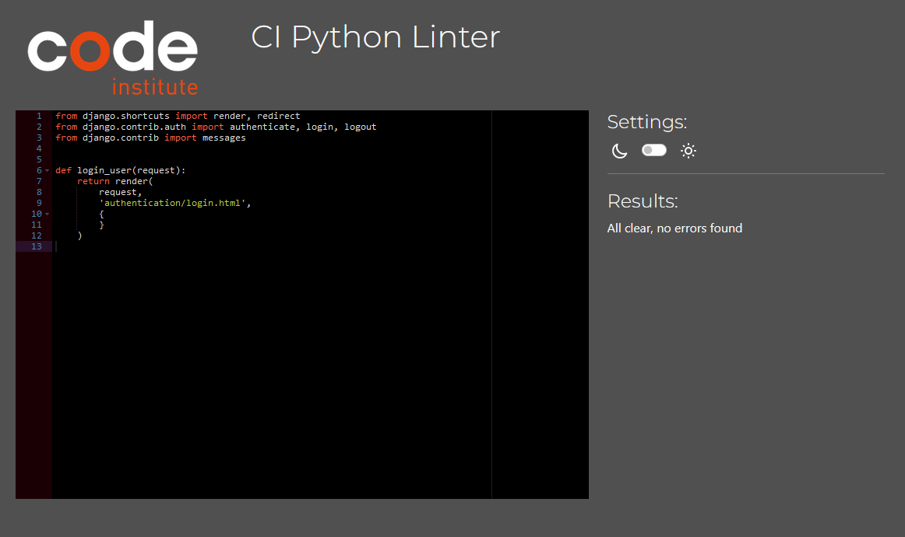
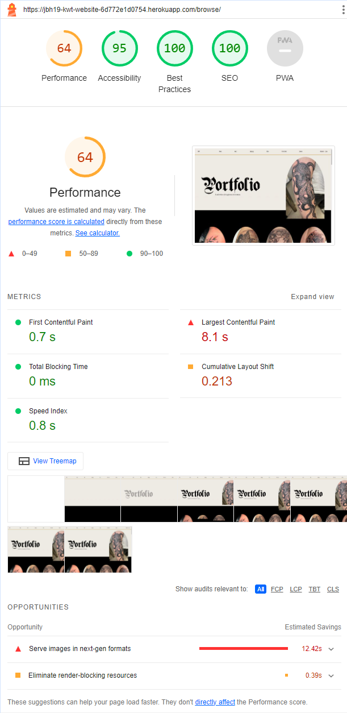
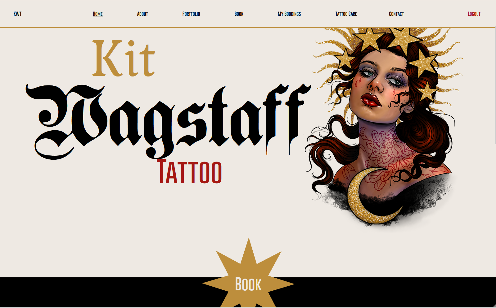

# Testing
  
Return back to the [README.md](README.md) file.
  
## Code Validation

### HTML

I have used the recommended [HTML W3C Validator](https://validator.w3.org) to validate all of my HTML files.

| Page | W3C URL | Screenshot | Notes |
| --- | --- | --- | --- |
| Home | [W3C](https://validator.w3.org/nu/?doc=https%3A%2F%2Fjbh19-kwt-website-6d772e1d0754.herokuapp.com%2F) |  | 3 sections lack header h2-h6 warning |
| About | [W3C](https://validator.w3.org/nu/?doc=https%3A%2F%2Fjbh19-kwt-website-6d772e1d0754.herokuapp.com%2Fabout%2F) |  | 3 sections lack header h2-h6 warning |
| Portfolio | [W3C](https://validator.w3.org/nu/?doc=https%3A%2F%2Fjbh19-kwt-website-6d772e1d0754.herokuapp.com%2Fbrowse%2F) |  | 3 sections lack header h2-h6 warning |
| Book | n/a |  | 2 sections lack header h2-h6 warning & action empty on form - left empty to avoid breaking Django setup |
| Update Booking | n/a |  | 1 section lack1 header h2-h6 warning & trailing slash on Django form |
| My Bookings | n/a |  | 2 sections lack header h2-h6 warning & duplicate ID - fixed |
| Tattoo Care | [W3C](https://validator.w3.org/nu/?doc=https%3A%2F%2Fjbh19-kwt-website-6d772e1d0754.herokuapp.com%2Fmisc%2Ftattoo-care%2F) |  | 1 section lack header h2-h6 warning & a few other errors - checked HTML file - fixed |
| Terms | [W3C](https://validator.w3.org/nu/?doc=https%3A%2F%2Fjbh19-kwt-website-6d772e1d0754.herokuapp.com%2Fmisc%2Fterms%2F) |  | 2 sections lack header h2-h6 warning |
| Logout | [W3C](https://validator.w3.org/nu/?doc=https%3A%2F%2Fjbh19-kwt-website-6d772e1d0754.herokuapp.com%2Faccounts%2Flogout%2F) |  | 3 sections lack header h2-h6 warning |
| Register | [W3C](https://validator.w3.org/nu/?doc=https%3A%2F%2Fjbh19-kwt-website-6d772e1d0754.herokuapp.com%2Faccounts%2Fsignup%2F) |  | 1 section lacks header h2-h6 warning |
| Login | [W3C](https://validator.w3.org/nu/?doc=https%3A%2F%2Fjbh19-kwt-website-6d772e1d0754.herokuapp.com%2Faccounts%2Flogin%2F) |  | 1 section lacks header h2-h6 warning |

### CSS

I have used the recommended [CSS Jigsaw Validator](https://jigsaw.w3.org/css-validator) to validate all of my CSS files.

| File | Jigsaw URL | Screenshot | Notes |
| --- | --- | --- | --- |
| style.css | [Jigsaw](https://jigsaw.w3.org/css-validator/validator?uri=https%3A%2F%2Fjbh19-kwt-website-6d772e1d0754.herokuapp.com%2F&profile=css3svg&usermedium=all&warning=1&vextwarning=&lang=en) |  | Numerous errors from Bootstrap and personal code - fixed personal code |

### JavaScript

I have used the recommended [JShint Validator](https://jshint.com) to validate all of my JS files.

| File | Screenshot | Notes |
| --- | --- | --- |
| script.js |  | No Errors |

### Python

I have used the recommended [PEP8 CI Python Linter](https://pep8ci.herokuapp.com) to validate all of my Python files.

| File | CI URL | Screenshot | Notes |
| --- | --- | --- | --- |
| manage.py | [PEP8 CI](https://pep8ci.herokuapp.com/https://raw.githubusercontent.com/Johan-Hennius/kit-wagstaff-tattoo/main/manage.py) |  | E501 lines too long - fixed |
| settings.py | [PEP8 CI](https://pep8ci.herokuapp.com/https://raw.githubusercontent.com/Johan-Hennius/kit-wagstaff-tattoo/main/kit_wagstaff_tattoo/settings.py#) |  | Numerous errors - fixed |
| urls.py | [PEP8 CI](https://pep8ci.herokuapp.com/https://raw.githubusercontent.com/Johan-Hennius/kit-wagstaff-tattoo/main/kit_wagstaff_tattoo/urls.py) |  | Traliing white space - fixed |
| urls.py | [PEP8 CI](https://pep8ci.herokuapp.com/https://raw.githubusercontent.com/Johan-Hennius/kit-wagstaff-tattoo/main/kwt_about/urls.py#) |  | No new line at end of file - fixed |
| views.py | [PEP8 CI](https://pep8ci.herokuapp.com/https://raw.githubusercontent.com/Johan-Hennius/kit-wagstaff-tattoo/main/kwt_about/views.py#) |  | Numerous errors - fixed |
| admin.py | [PEP8 CI](https://pep8ci.herokuapp.com/https://raw.githubusercontent.com/Johan-Hennius/kit-wagstaff-tattoo/main/kwt_appointment/admin.py#) |  | Numerous errors - fixed |
| forms.py | [PEP8 CI](https://pep8ci.herokuapp.com/https://raw.githubusercontent.com/Johan-Hennius/kit-wagstaff-tattoo/main/kwt_appointment/forms.py) |  | Numerous errors - fixed |
| models.py | [PEP8 CI](https://pep8ci.herokuapp.com/https://raw.githubusercontent.com/Johan-Hennius/kit-wagstaff-tattoo/main/kwt_appointment/models.py) |  | Numerous errors - fixed |
| urls.py | [PEP8 CI](https://pep8ci.herokuapp.com/https://raw.githubusercontent.com/Johan-Hennius/kit-wagstaff-tattoo/main/kwt_appointment/urls.py) |  | Numerous errors - fixed |
| views.py | [PEP8 CI](https://pep8ci.herokuapp.com/https://raw.githubusercontent.com/Johan-Hennius/kit-wagstaff-tattoo/main/kwt_appointment/views.py) |  | Numerous errors - fixed |
| admin.py | [PEP8 CI](https://pep8ci.herokuapp.com/https://raw.githubusercontent.com/Johan-Hennius/kit-wagstaff-tattoo/main/kwt_gallery/admin.py) |  | No errors |
| models.py | [PEP8 CI](https://pep8ci.herokuapp.com/https://raw.githubusercontent.com/Johan-Hennius/kit-wagstaff-tattoo/main/kwt_gallery/models.py#) |  | Numerous errors - fixed |
| urls.py | [PEP8 CI](https://pep8ci.herokuapp.com/https://raw.githubusercontent.com/Johan-Hennius/kit-wagstaff-tattoo/main/kwt_gallery/urls.py) |  | No new line at end - fixed |
| views.py | [PEP8 CI](https://pep8ci.herokuapp.com/https://raw.githubusercontent.com/Johan-Hennius/kit-wagstaff-tattoo/main/kwt_gallery/views.py) |  | Numerous errors - fixed |
| urls.py | [PEP8 CI](https://pep8ci.herokuapp.com/https://raw.githubusercontent.com/Johan-Hennius/kit-wagstaff-tattoo/main/kwt_home/urls.py) |  | No new line at end - fixed |
| views.py | [PEP8 CI](https://pep8ci.herokuapp.com/https://raw.githubusercontent.com/Johan-Hennius/kit-wagstaff-tattoo/main/kwt_home/views.py) |  | Couple of errors - fixed |
| urls.py | [PEP8 CI](https://pep8ci.herokuapp.com/https://raw.githubusercontent.com/Johan-Hennius/kit-wagstaff-tattoo/main/kwt_misc/urls.py) |  | No new line at end - fixed |
| views.py | [PEP8 CI](https://pep8ci.herokuapp.com/https://raw.githubusercontent.com/Johan-Hennius/kit-wagstaff-tattoo/main/kwt_misc/views.py) |  | No new line at end - fixed |
| urls.py | [PEP8 CI](https://pep8ci.herokuapp.com/https://raw.githubusercontent.com/Johan-Hennius/kit-wagstaff-tattoo/main/kwt_users/urls.py) |  | No new line at end - fixed |
| views.py | [PEP8 CI](https://pep8ci.herokuapp.com/https://raw.githubusercontent.com/Johan-Hennius/kit-wagstaff-tattoo/main/kwt_users/views.py) |  | Couple of errors - fixed |


## Browser Compatibility

I've tested my deployed project on multiple browsers to check for compatibility issues.  
All dimensions set at 1600 x 992.

| Browser | Home | Portfolio | Book | My Bookings | Notes |
| --- | --- | --- | --- | --- | --- |
| Chrome |  |  |  |  | Works as expected |
| Firefox |  |  |  |  | Works as expected |
| Edge |  |  |  |  | Works as expected |

## Responsiveness

I've tested my deployed project on multiple devices to check for responsiveness issues.

| Device | Home | About | Portfolio | Notes |
| --- | --- | --- | --- | --- |
| iPhone 11 (DevTools) |  |  |  | Works as expected |
| Tablet (DevTools) |  |  |  | Works as expected |
| Desktop |  |  |  | Works as expected |
| XL Monitor |  |  |  | Works as expected |

## Lighthouse Audit

I've tested my deployed project using the Lighthouse Audit tool to check for any major issues.

| Page | Mobile | Desktop | Notes |
| --- | --- | --- | --- |
| Home |  |  | Slow response due to JS and images on mobile & some minor warnings on desktop |
| About |  |  | Some minor warnings |
| Portfolio |  |  | Slow response time due to large images |

## Defensive Programming

Defensive programming was manually tested with the below user acceptance testing:

| Page | Expectation | Test | Result | Fix | Screenshot |
| --- | --- | --- | --- | --- | --- |
| Home | | | | | |
| | Navbar is expected to not show "my bookings" if user is not logged in/registered | Tested the feature by loading main page and brute forcing the my-bookings url | The feature behaved as expected, and it did not let the guest through | Test concluded and passed |   |
| | Book button will take guest to registration and logged in user to book page | Tested the feature by doing clicking in both logged in and logged out status | Test concluded and passed |   |
| Update Booking | | | | | |
| | The update/edit booking feature should allow user to only edit their own booking | Tested the feature by adding pk to url - brute force | The feature behaved as expected and blocked the user | Test concluded and passed |  |
| | Booking form is expected to flag empty fields before submitting | Tested the feature by leaving fields empty and submitting | Test concluded and passed |  |

## User Story Testing

| User Story | Screenshot |
| --- | --- |
| As a customer i want to easily book a tattoo appoinment so that i can avoid convoluted booking processes. |   |
| As a customer i want to have the ability to update an appointment so that i can request changes if they are needed. |   |
| As a customer i want to ensure that only i can access my appointments so that unknown users cannot edit my appointments or see personal info. |  |
| As a customer i want to get to know the artist so that i feel comfortable. |  |
| As a site owner i want to get as much information as possible in the booking process so that the design process is straight forward. |  |
| As a site owner i want to easily access my upcoming appointments so that i can manage my business effectively. |  |
| As a site owner i want to give my clients clear instructions for tattoo after care so that they can avoid risk of infection. |  |
| As a site owner i want to have a clean and intuitive site so that my customer's journey is effortless and encourages repeat visits. |  |

## Javascript testing

JavaScript was manually tested with the below user acceptance testing:

| Page | Expectation | Test | Result | Fix | Screenshot |
| --- | --- | --- | --- | --- | --- |
| Home | | | | | |
| | Elements are expected to reveal on scroll - same across all pages | Tested the feature by loading pages and scrolling down | The JS behaved as expected | Test concluded and passed |  |

``` JavaScript
/* jshint esversion: 11 */
// On scroll reveal animation
const observer = new IntersectionObserver((entries) => {
    entries.forEach((entry) => {
        if (entry.isIntersecting) {
            entry.target.classList.add("show");
        } else {
            entry.target.classList.remove("show");
        }
    });
});

const hiddenElements = document.querySelectorAll(".hidden");
hiddenElements.forEach((el) => observer.observe(el));
```

## Python Testing

Python was manually tested with the below user acceptance testing:

| Page | Expectation | Test | Result | Fix | Screenshot |
| --- | --- | --- | --- | --- | --- |
| Book | | | | | |
| | Registered users should be able to book appointment | Tested the functionality by creating a booking while signed in | The functionality behaved as expected | Test concluded and passed |  |
| | Registered users should be able to edit their bookings | Tested the functionality by editing booking | The functionality behaved as expected | Test concluded and passed |  |
| | Registered users should be able to delete their bookings | Tested the functionality by deleting booking | The functionality behaved as expected | Test concluded and passed |  |
| Portfolio | | | | | |
| | The portfolio should loop through the portfolio database and display uploaded images | Tested the feature by loading portfolio | The feature behaved as expected | Test concluded and passed |  |

## Bugs

During the development process, i did not take screenshots of the bugs that arose. I decided to fix the bugs as and when they arrived to avoid exiting the flow state.

- General: Images not loading.

    - To fix this, I checked all of my image paths.

- Python: Form submit. Form would not accept email input.

    - To fix this, I removed this email input from the form and autofilled it with the user's info in the view.

- Python: Form update. Form would not pre-populate.

    - To fix this, I created the form variable using instance=booking which referenced the booking by it's ID.

- Python: Form update. Block brute force correctly. Form would not load.

    - To fix this, I created the booking instance using get_object_404(Booking, id=booking_id). 
    And used the following if statement:
    ``` Python 
    if booking.email_address != request.user:
    ```

- HTML & Python: Delete Modal. Delete button would not call on delete modal.

    - To fix this, the booking ID needed to be placed in the modal's id and the modal itself needed to be within the for loop.

- HTML & Python: Portfolio/Gallery. Images not being displayed.

    - To fix this, i ensured that i used the correct words in the dot notation function = {{ image.gallery_image.url }}

- HTML & Python: Booking Form - Terms & Conditions Checkbox. The checkbox did not line-up with the label. Label could not contain an anchor tag

    - To fix this, i stated in the view that the booking.terms = True when saved. On the template page i put a separate required terms & conditions form-check which the user had to check to submit.
    ``` Python view 
    if request.method == "POST":
        form = BookingForm(
            request.POST or None,
            request.FILES,
            instance=booking
        )
        if form.is_valid():
            booking = form.save(commit=False)
            booking.confirmed = False
            booking.terms = True
            form.save()
            messages.success(request, "Booking updated and awaiting approval")
            return redirect(reverse("my_bookings"))
        messages.error(request, "An error occured, please try again!")
    else:
        form = BookingForm(instance=booking)
    ```

    ``` HTML form
    <div class="form-check">
        <input class="form-check-input" type="checkbox" value="" id="termsCheck" required>
        <label class="form-check-label" for="termsCheck">
            I have read and agreed to the <a href="">Terms and Conditions</a>
        </label>
    </div>
    ```

- CSS: H1 being cut off on mobile devices. The heading element on every page was cut off, showing only half of the heading.

    - To fix this, i added padding to the top of each heading element.

- CSS: Overflow-X in book button div. The right hand side of the book button div had overflow because i set the width to 102% in order to close up a gap.

    - To fix this, i removed the width settings on the book buttons' divs and their parent divs.


**Open Issues**

Any remaining open issues can be tracked [here](https://github.com/Johan-Hennius/kit-wagstaff-tattoo/issues).

## Unfixed Bugs

There are no remaining bugs that I am aware of.
